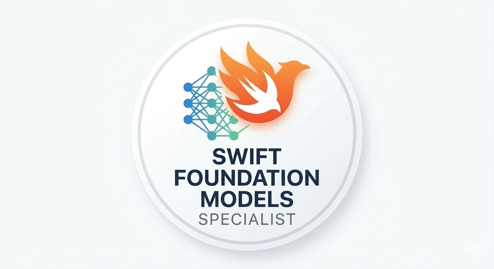

<p align="center">
  
</p>

<h1 align="center">Swift Foundation Models Specialist</h1>

<p align="center">
  An Agent Skill for reviewing and writing Swift code that integrates Apple's Foundation Models framework — correctly, safely, and production-ready.<br>
  Compatible with Claude Code, Cursor, Codex, Gemini CLI, and any agent that supports the <a href="https://agentskills.io">Agent Skills</a> format.
</p>

<p align="center">
  
  
  
  <a href="https://www.linkedin.com/in/cvsouza42/"></a>
</p>

---

## What This Skill Does

This skill turns Claude into a specialist for on-device AI features on Apple platforms. It reviews and generates Swift code that uses `FoundationModels`, enforcing architecture rules, security practices, and API correctness derived from WWDC25 sessions and Apple's official technotes.

Use it when you are:
- Integrating `LanguageModelSession` into an iOS or macOS app
- Designing structured generation with `@Generable` and `@Guide`
- Reviewing AI feature code for correctness, testability, and layering
- Handling LLM-specific errors, availability gating, and context window recovery
- Implementing the `Tool` protocol for function calling
- Adding streaming, prewarming, or performance optimizations

## Installation

This skill follows the [Agent Skills](https://agentskills.io) open format and works across multiple AI agents.

**One-line install (recommended)**
```bash
npx skills add caiovsouza48/swift-foundation-models-specialist
```

The CLI will prompt you to select your agent (Claude Code, Cursor, Codex, Gemini, etc.) and whether to install globally or per-project.

**Manual install**

Claude Code:
```bash
cp -r swift-foundation-models-specialist ~/.claude/skills/swift-foundation-models-specialist
```

Cursor:
```bash
cp -r swift-foundation-models-specialist ~/.cursor/skills/swift-foundation-models-specialist
```

For other agents, copy the folder to wherever your agent resolves skills and reference it per that agent's documentation.

The skill is activated automatically when the agent detects relevant keywords (`FoundationModels`, `LanguageModelSession`, `@Generable`, etc.) in the conversation.

## Requirements

- iOS 26 / macOS 26 deployment target
- Swift 6.2+ with strict concurrency
- Apple Intelligence-capable device for on-device inference

## Reference Files

| File | Covers |
|---|---|
| `references/architecture.md` | Three-layer rule, infrastructure boundary, dependency inversion |
| `references/sessions.md` | `LanguageModelSession` lifecycle, multi-turn conversations, prewarming |
| `references/structured-output.md` | `@Generable`, `@Guide` constraints, property ordering, `DynamicGenerationSchema` |
| `references/generation-options.md` | `.greedy` vs `.random` sampling, temperature, `maximumResponseTokens` |
| `references/error-handling.md` | All 7 `GenerationError` cases, context window recovery tiers, guardrails |
| `references/availability.md` | `SystemLanguageModel.default.availability`, fallback UI patterns |
| `references/prompt-design.md` | Instructions vs. prompts, prompt injection defense, Swiss Cheese safety model |
| `references/testing.md` | Protocol stubs, acceptance test pyramid, evaluation pipelines |
| `references/tool-calling.md` | `Tool` protocol, `@Generable` arguments, `ToolOutput`, `ToolCallError` |
| `references/performance.md` | `streamResponse`, partial rendering, Instruments profiling |

## Benchmark

Evaluated using the [Claude skill-creator skill](https://github.com/anthropics/skills/tree/main/skills/skill-creator) against 3 test cases (architecture, availability, error handling) comparing with-skill vs. without-skill runs on `claude-sonnet-4-6`.

| | With Skill | Without Skill |
|---|---|---|
| **Score** | 13 / 15 | 6 / 15 |
| **Pass Rate** | **86.7%** | **40.0%** |
| **Lift** | **+46.7 pp** | — |
| **Avg Tokens** | 23,137 | 11,625 |

| Eval | With Skill | Without Skill |
|---|---|---|
| Architecture & Injection | 6 / 6 (100%) | 4 / 6 (67%) |
| Availability & Session | 3 / 4 (75%) | 1 / 4 (25%) |
| Error Handling & @Generable | 4 / 5 (80%) | 1 / 5 (20%) |

Key findings: without the skill, the model treats `LanguageModelSession` in a ViewModel as a trade-off rather than a rule violation, invents non-existent API names (`LanguageModelError`, `.downloading`), and misses property-ordering's impact on generation quality entirely.

## Core Rules

- **`LanguageModelSession` lives exclusively in the infrastructure layer** — never in view models or use cases
- **Depend on protocols, not on `LanguageModelSession` directly** — enables testing without Apple Intelligence hardware
- **Use `@Generable` for all structured output** — never parse free-form LLM text
- **Handle all LLM-specific error paths** — `guardrailViolation`, `exceededContextWindowSize`, `unsupportedLanguageOrLocale`, and more
- **Gate every AI feature on `SystemLanguageModel.default.availability`** — the model is not always present
- **Never embed user input in instructions** — prompt injection defense
